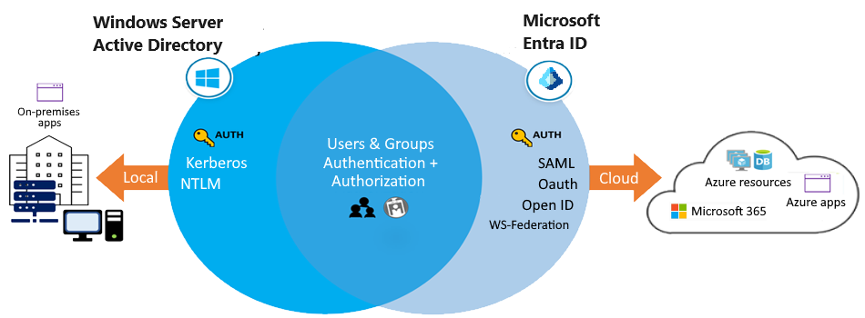
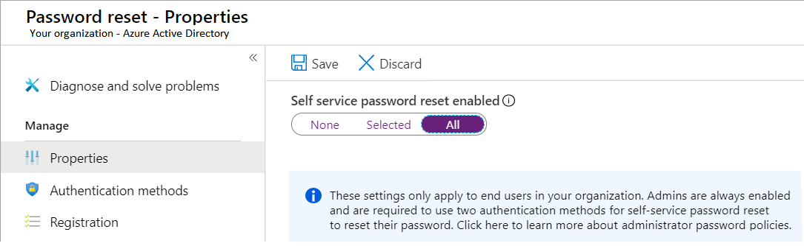

# Microsoft Entra ID

Learning objectives
- **Define Microsoft Entra concepts, including identities, accounts, and tenants.**
- Describe Microsoft Entra features to support different configurations.d
- Understand differences between Microsoft Entra ID and Active Directory Domain Services (AD DS).
- Choose between supported editions of Microsoft Entra ID.
- Understand Microsoft Entra join.
- Understand Microsoft Entra self-service password reset.

Microsoft Entra ID is a **cloud-based directory and identity management service** that supports USERS access to various **resources and applications**.

With Microsoft Entra ID, you can provide your users with seamless access to internal and external resources (e.g. tenants, identities, accounts, and Azure subscriptions.).  

By implementing Microsoft Entra ID, you can enhance security, improve productivity, and reduce costs for your organization.  

> Different editions of Microsoft Entra ID has its own features.  

- in this example, Windows Server AD is using `Kerberos` and `NTLM authentication` to on-premises applications.

## Entra ID Features 

1. SSO access :  
Secure SSO to web apps on the cloud and to on-premises apps  
Users can **sign in with the same set of credentials** to access all their apps.
2. Ubiquitous device support :  
Offer a common experience across the difference platform or OS devices  
Users can launch apps from a personalized web-based access panel, mobile app, Microsoft 365, or custom company portals by using their existing work credentials.  
3. Secure remote access :  
**Secure access can include `multifactor authentication` (MFA), `conditional access policies`, and `group-based access management`**  
Users can access on-premises web apps from everywhere, including from the same portal.  
4. Cloud extensibility : 
Microsoft Entra ID can extend to the cloud to help you manage a consistent set of users, groups, passwords, and devices across environments.  
5. Sensitive data protection :  
Admins can monitor for suspicious sign-in activity and potential vulnerabilities in a consolidated view of users and resources in the directory.  
6. Self-service support	:
Microsoft Entra ID lets you delegate selected administrator tasks to company employees.  
**Providing self-service app access and password management through verification steps can reduce helpdesk calls and enhance security.**

## Considerations

`[ACROSS PLATFORM]` Consider `enabling SSO`. 
Allow your users to connect to the cloud or use on-premises apps.   
Microsoft Entra SSO supports Microsoft 365 and thousands of SaaS apps, such as Salesforce, Workday, DocuSign, ServiceNow, and Box.  

`[GUI INTERFACE]` Consider `UX and device support`.  
Build a consistent user experience that works for all devices and directory access points.  
**You can design custom company portals and personalized web-based access for your employees that lets them connect with their existing work credentials.**

Consider benefits of `secure remote access`.  
Protect your on-premises web apps by implementing secure remote access with MFA and access policies.

`[Management]` Consider advantages of `cloud extensibility`. 
Connect Active Directory and other on-premises directories in the cloud to Microsoft Entra ID.  
Make it easier for your admins to manage the same users, groups, passwords, and devices across all supported environments.  

Consider advanced protection for sensitive data.  
Enhance the security of your sensitive data and apps by **using the built-in protection features of Microsoft Entra ID.**  
Your admins can utilize advanced security reports, notifications, remediation recommendations, and risk-based policies.

Consider `reduced costs, self-service options`.   
Take advantage of the Microsoft Entra self-service features to help reduce costs for your organization. **Delegate certain tasks like resetting passwords, or creating and managing groups to your nonadmin users.**

## Concept 

Key component of MS Entra ID  
1. `Identity` : 
An identity is an object that can be authenticated. The identity can be a user with a username and password.
2. `Account` : 
An account is an identity that has (VALID) data associated with it.
3. MS Entra Account 
4. AZ Tenant Directory : 
**An Azure tenant is a single dedicated and trusted instance of Microsoft Entra ID. Each tenant (also called a directory) represents a single organization. When your organization signs up for a Microsoft cloud service subscription, a new tenant is automatically created.**
5. AZ Subscriptions : 
An Azure subscription is used to pay for Azure cloud services.  
Each subscription is joined to a single tenant.   

> If you're a Microsoft 365, Azure, or Dynamics CRM Online customer, you might already be using Microsoft Entra ID. 
You can start using your tenant to manage access to thousands of other cloud apps that integrate with Microsoft Entra ID.

## AD DS

Active Directory Domain Services (AD DS) is the **traditional deployment of Windows Server-based Active Directory on a physical or virtual server.**   

Active Directory Domain Services (AD DS) also includes 
- Active Directory Certificate Services (AD CS), 
- Active Directory Lightweight Directory Services (AD LDS), 
- Active Directory Federation Services (AD FS), 
- and Active Directory Rights Management Services (AD RMS).

> Although you can deploy and manage AD DS in Azure Virtual Machines,still recommend you use Microsoft Entra ID, unless your configuration targets IaaS workloads that depend specifically on AD DS.

### when using Microsoft Entra rather than AD DS

Microsoft Entra ID is similar to AD DS, but there are significant differences.

Identity solution: 
**AD DS is primarily a directory service, while Microsoft Entra ID is af ull identity solution.**   
**Microsoft Entra ID is designed for internet-based applications that use HTTP and HTTPS communications.**  
The features and capabilities of Microsoft Entra ID support target strong identity management.

Communication protocols:   
**Because Microsoft Entra ID is based on HTTP and HTTPS, it doesn't use Kerberos authentication.**   
Microsoft Entra ID implements HTTP and HTTPS protocols, **such as SAML, WS-Federation, and OpenID Connect for authentication (and OAuth for authorization).**

Federation services: 
Microsoft Entra ID includes federation services, and many third-party services like Facebook.

Flat structure:   
Microsoft Entra users and groups are created in a flat structure. 
**There are no organizational units (OUs) or group policy objects (GPOs).**  

Managed service: 
**Microsoft Entra ID is a `managed service`. You manage only `users`, `groups`, and `policies`.** 
**If you deploy AD DS with virtual machines by using Azure, you manage many other tasks, including deployment, configuration, virtual machines, patching, and other backend processes.**

## Entra editions

Microsoft Entra ID comes in 4 editions: 
1. Free
2. Microsoft 365 Apps
3. Premium P1
4. Premium P2 

The Free edition is included with an Azure subscription. 

The Premium editions are available through a Microsoft Enterprise Agreement, the Open Volume License Program, and the Cloud Solution Providers program.  

**Azure and Microsoft 365 subscribers can also buy Microsoft Entra ID P1 and P2 online.**

https://learn.microsoft.com/en-us/training/modules/configure-azure-active-directory/5-select-editions  .

## Microsoft Entra `JOIN` Implementation

### Features

Single-Sign-On (SSO)	
- Joined devices offer SSO access to your Azure-managed SaaS apps and services.   
Your users won't need extra authentication prompts when they access work resources.   
The SSO functionality is available even when users aren't connected to the domain network.   

Enterprise state roaming	
- Starting in Windows 10, your users can securely synchronize their user settings and app settings data to joined devices. Enterprise state roaming reduces the time to configure a new device.

Windows Hello	
- Provide your users with secure and convenient access to work resources from joined devices.

Restriction of access	
- Restrict user access to apps from only joined devices that meet your compliance policies.

Seamless access to on-premises resources	
- Joined devices have seamless access to on-premises resources, when the device has line of sight to the on-premises domain controller.

### Consideration

Consider connection options. Connect your device to Microsoft Entra ID in one of two ways:

Register your device to Microsoft Entra ID so you can manage the device identity. Microsoft Entra device registration provides the device with an identity that's used to authenticate the device when a user signs into Microsoft Entra ID. You can use the identity to enable or disable the device.

Join your device, which is an extension of registering a device. Joining provides the benefits of registering, and also changes the local state of the device. Changing the local state enables your users to sign into a device by using an organizational work or school account instead of a personal account.

Consider combining registration with other solutions. Combine registration with a mobile device management (MDM) solution like Microsoft Intune, to provide other device attributes in Microsoft Entra ID. You can create conditional access rules that enforce access from devices to meet organization standards for security and compliance.

Consider other implementation scenarios. Although AD Join is intended for organizations that have an on-premises Windows Server Active Directory infrastructure, it can be used for other scenarios like branch offices.

## Microsoft Entra self-service password reset Implementation

The Microsoft Entra self-service password reset (SSPR) feature lets you give users the ability to bypass helpdesk and reset their own passwords.

https://learn.microsoft.com/en-us/training/modules/configure-azure-active-directory/7-implement-self-service-password-reset

### Features

1. SSPR requires a MS Entra Account with `Global Administrator Privileges`.  
2. SSPR uses a group to limit the users who have SSPR privileges.  
3. user account who allow to use SSPR must have a valid license.  

### Considerations

Consider who can reset their passwords
- In the Azure portal, there are three options for the SSPR feature: None, Selected, and All.  
- The Selected option is useful for creating specific groups who have SSPR enabled.  

  

Consider your authentication methods
- Require At Least One Authentication method to reset password
- Other methods that are provided by SSPR plan including email notification, text message, or a security code sent to the user's mobile. also offer the users a set of security questions. 
  
Consider the Security Question
- you can security require  questions to be registered for the users in your Microsoft Entra tenant, and configure how many correctly answered security questions are required for a successful password reset

Consider combining methods for stronger security.
For example combining security questions(less safe) with other authentication methods to make consolidate security

## Summary

- Microsoft Entra ID is a cloud-based directory and identity management service that supports user access to various resources and applications.
- Microsoft Entra ID provides benefits such as enhanced security, consistent user experience, reduced costs, and improved productivity.
- Microsoft Entra ID consists of several key components and concepts, including identities, accounts, tenants, and subscriptions.
- Microsoft Entra ID provides a cloud based alternative to Active Directory Domain Services (AD DS).
- Microsoft Entra ID comes in four editions, each offering different features and capabilities.
Self-service password reset gives users the ability to bypass the helpdesk and reset their own passwords.

[Summary and resources](https://learn.microsoft.com/en-us/training/modules/configure-azure-active-directory/9-summary-resources)