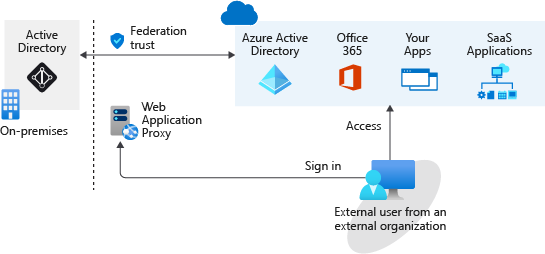

# Microsoft Entra B2B

With Microsoft Entra business to business (B2B), you can add people from other companies to your Microsoft Entra tenant as guest users.

If your organization has multiple Microsoft Entra tenants, you may also want to use Microsoft Entra B2B to give a user in tenant A access to resources in tenant B

> Each Microsoft Entra tenant is distinct and separate from other Microsoft Entra tenants and has its own representation of identities and app registrations.

You can grant guest user access with the appropriate restrictions in place, then remove access when the work is done.

Invite guest users to the Microsoft Entra organization, group, or application. (and their account/guests is added to Microsoft Entra ID as a guest account.)

The guest can get the invitation through
1. Email
2. direct link

> **By default, users and administrators in Microsoft Entra ID can invite guest users, but the `Global Administrator` can limit or disable this ability.**

With Microsoft Entra B2B, you don't have to manage your external users' identities

With Microsoft Entra B2B, you don't take on the responsibility of managing and authenticating the credentials and identities of partners.

You don't need an AD administrator to create and manage external user accounts. 
Any authorized user can invite other users.  

When collaboration is no longer needed, you can easily remove these external users.

A federation is where you have a trust established with another organization, or a collection of domains, for shared access to a set of resources.  

You might be using an on-premises identity provider and authorization service like Active Directory Federation Services (AD FS) that has an established trust with Microsoft Entra ID.

To get access to resources, all users have to provide their credentials and successfully authenticate against the AD FS server.

If you have someone trying to authenticate outside the internal network, you need to set up a web application proxy
  

An on-premises federation with Microsoft Entra ID might be good if your organization wants all authentication to Azure resources to happen in the local environment. 

With a B2B collaboration, Authentication is done directly through Azure. 