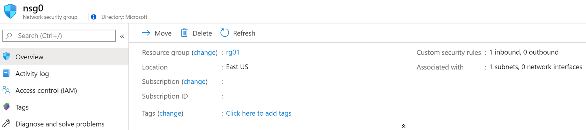
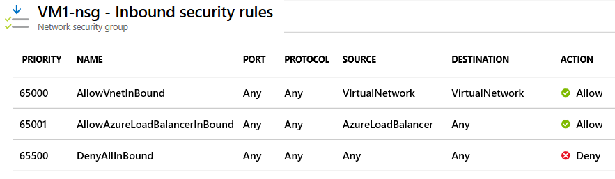
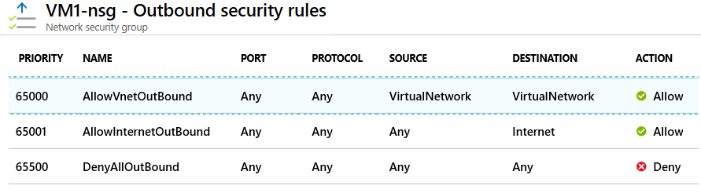
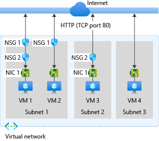
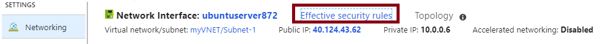
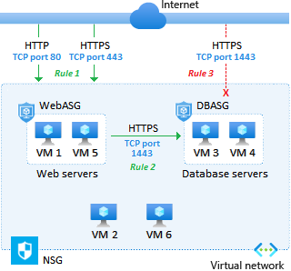
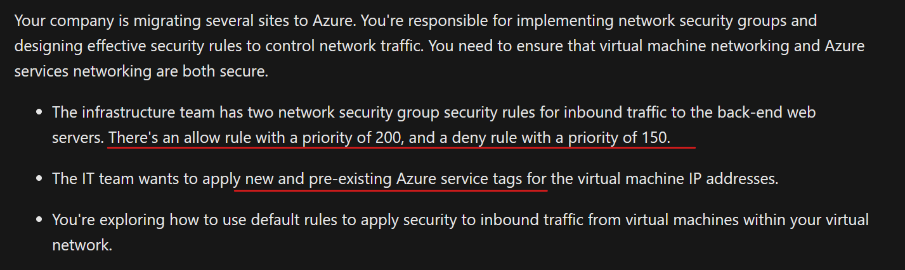
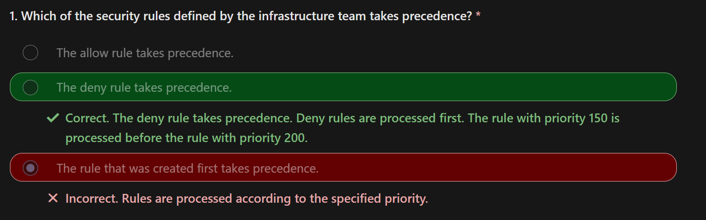
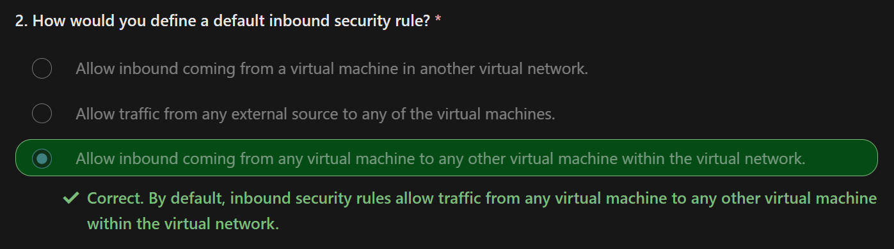
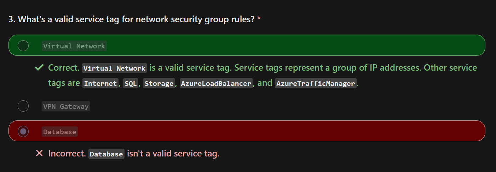

# Network Security 

Network security groups are a way to limit network traffic to resources in your virtual network. 

Catch Up
- Network security groups are essential for controlling network traffic in Azure virtual networks.
- NSG rules are evaluated and processed based on priority and can be created for subnets and network interfaces.
- Effective NSG rules can be achieved by considering rule precedence, intra-subnet traffic, and managing rule priority.
- Application security groups provide an application-centric view of infrastructure and simplify rule management.

## Network Security Groups, NSGs

**You can limit/control network traffic to resources in your virtual network by using a network security group.**  

A network security group contains a list of security rules to allow or deny inbound or outbound traffic 

## Associations

A network security group can be associated 
- to a subnet or a network interface.  
- multiple times

The `Overview` page for a virtual machine provides information about the associated network security groups.

## DMZ/demilitarized zone

A DMZ acts as a buffer between resources within your virtual network and the internet.

## Assign to subnet or NIC

For Subnet
- Use the network security group to restrict traffic flow to all machines that reside within the subnet.
- Each subnet can have a `maximum of one` associated network security group.

for NIC
- Define network security group rules to control all traffic that flows through a NIC.
- **Each network interface that exists in a subnet can have `zero`, or one, associated network security groups**

## Security Rules 

Security rules in network security groups enable you to filter (in and out) network traffic.

Azure creates the default security rules in each network security group that you create and YOU CAN NOT REMOVE IT.  
**You can override a default security rule by creating another security rule with a higher Priority setting for your network security group.**

Configure rules to a network security group by specifying conditions for any of the following settings:
- Name
- `Priority`
- Port
- Protocol (`Any`, `TCP`, `UDP`)
- Source (`Any`, `IP addresses`, `Service tag`)
- Destination (`Any`, `IP addresses`, `Virtual network`)
- Action (`Allow` or `Deny`)

All security rules for a network security group are processed in priority order.

Examples

- Allow inbound traffic from your virtual network and Azure load balancers ONLY

- Only allow outbound traffic to the internet and your virtual network. 

### Process

Each network security group and its defined security rules are evaluated independently.

For inbound traffic, Azure first processes network security group security rules for any associated `subnets` and then any associated `network interfaces`.  
For outbound traffic, the process is reversed. Azure first evaluates network security group security rules for any associated network interfaces followed by any associated subnets.  
 
For both the inbound and outbound evaluation process, Azure also checks how to apply the rules for intra-subnet traffic.

- :arrow_up: Show network security groups (NSGs) controlling traffic to virtual machines (VMs). 
- :arrow_up: The configuration requires security rules to manage network traffic `to and from` the internet over TCP port `80` via the network interface.
- Subnet 1 contains two virtual machines: VM 1 and VM 2. 
- Subnet 2 and Subnet 3 each contain one virtual machine: VM 3 and VM 4, respectively. 
- **Each VM has a network interface card (NIC).**

### Inbound traffic effective rules

Azure identifies if the VMs are members of an NSG, and if they have an associated subnet or NIC.

When an NSG is created, Azure creates the default security rule `DenyAllInbound` (deny all inbound traffic from the internet) for the group.

If an NSG has a subnet or NIC, the rules for the subnet or NIC can override the default Azure security rules.

> In the same VM, NSG inbound rules for a subnet take precedence over (`>>>>`) the ones for a NIC 

### Outbound traffic effective rules

Azure processes rules for outbound traffic by first examining NSG associations for NICs in all VMs.

When an NSG is created, Azure creates the default security rule `AllowInternetOutbound` (allow all outbound traffic to the internet.) for the group. 

If an NSG has a subnet or NIC, the rules for the subnet or NIC can override the default Azure security rules.

NSG outbound rules for a NIC in a VM take precedence over (`>>>>`) the ones for a subnet.

### View effective security rules

If you have several network security groups and aren't sure which security rules are being applied, you can use the Effective security rules link in the Azure portal to verify which security rules are applied to your machines, subnets, and network interfaces.

`Setting | Networking`  

### Creations

You can configure your virtual network security group rule settings, and select from a large variety of communication services, including HTTPS, RDP, FTP, and DNS.

Source
- The source filter can be any resource, an IP address range, an application security group, or a default tag.

Destination
- The value can be any resource, an IP address range, an application security group, or a default tag.

Service
- you can choose a predefined service like RDP or SSH or provide a custom port range.

Priority
- The lower the priority value, the higher priority for the rule.  

## Application Security Groups

Application security groups work in the same way as network security groups.

You join your virtual machines to an application security group.  
Then you use the application security group as a source or destination in the network security group rules.

- We have six virtual machines in our configuration with two web servers and two database servers.
- Customers access the online catalog hosted on our web servers.
- The web servers must be accessible from the internet over HTTP port 80 and HTTPS port 443.
- Inventory information is stored on our database servers.
- The database servers must be accessible over HTTPS port 1433.
- Only our web servers should have access to our database servers.

1. **Create `application security groups,ASG` for the VMs.**   
Create an application security group named WebASG to group our web server machines.  
Create an application security group named DBASG to group our database server machines. 
1. **Assign the `network interface` for the VMs.**   
For each VM server, assign its NIC to the appropriate application security group.  
1. **Create the `NSG` and `security rules`.**  
`Rule 1`: Set Priority to 100. Allow access from the internet to machines in the WebASG group from HTTP port 80 and HTTPS port 443.   
`Rule 1` has the lowest priority value, so it has precedence over the other rules in the group. Customer access to our online catalog is paramount in our design.   
`Rule 2`: Set Priority to 110. Allow access from machines in the WebASG group to machines in the DBASG group over HTTPS port 1433.   
`Rule 3`: Set Priority to 120. Deny (X) access from anywhere to machines in the DBASG group over HTTPS port 1433.    
`Rule 2` and `Rule 3` ensures that only our web servers can access our database servers.    

### Considerations

Consider IP address maintenance.  
- If you have many virtual machines in your configuration, it can be difficult to specify all of the affected IP addresses.

Consider no subnets.  

Consider simplified rules
- **Application security groups help to eliminate the need for multiple rule sets. You don't need to create a separate rule for each virtual machine.** New security rules are automatically applied to all the virtual machines in the specified application security group.

Consider workload support
- A configuration that implements application security groups is easy to maintain and understand because the organization is based on workload usage (for your applications, services, data storage, and workloads.)  

## In Actions

https://learn.microsoft.com/en-us/training/modules/configure-network-security-groups/7-simulation-create-network-groups

  
  
  
  